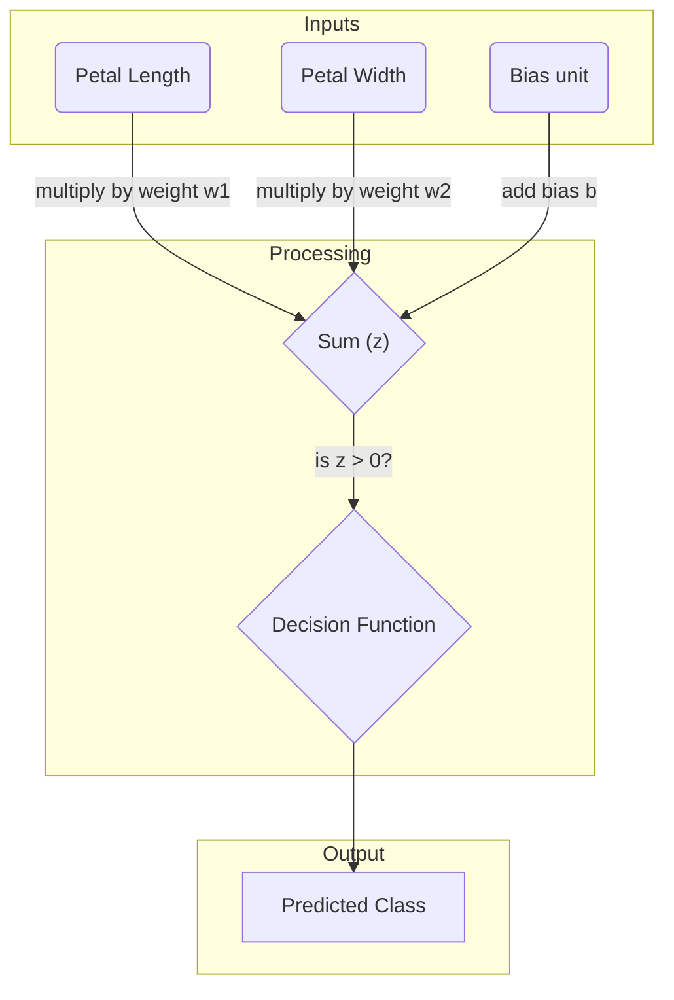
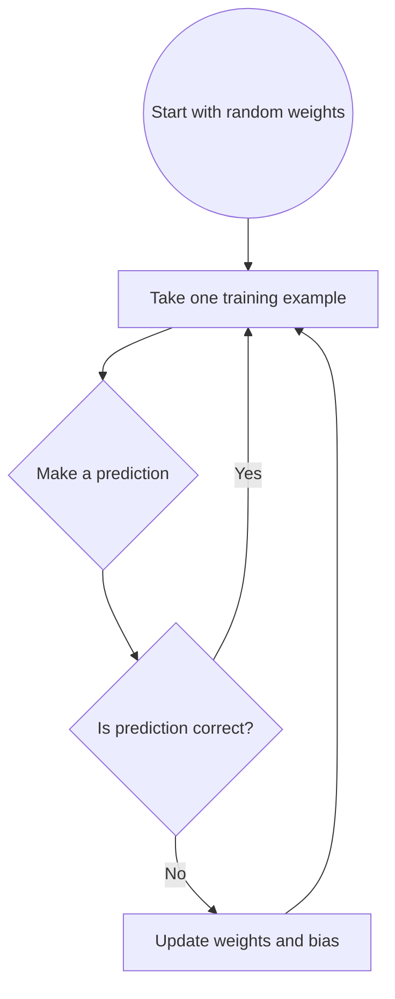
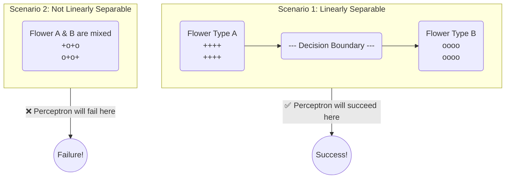
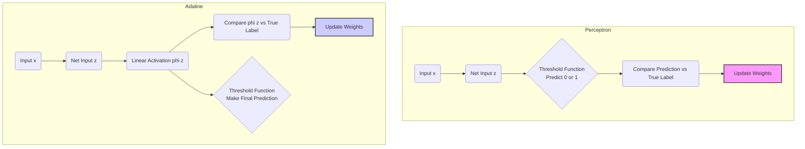
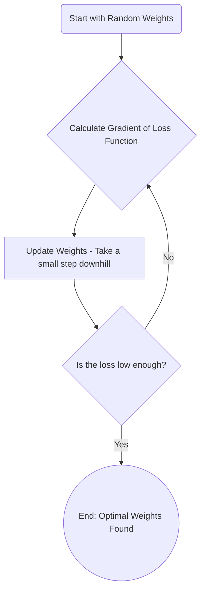
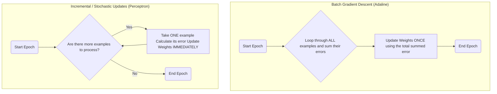

### **Teaching a Computer to Classify, The Simple Way**

Imagine you have a big pile of photos, and you want to teach a computer to automatically sort them into two piles: "cat photos" and "dog photos." How would a computer even start to learn this? This chapter introduces the very first, basic "brain cell" we can build in a computer to do jobs like this.

We'll be exploring two of the earliest methods: the **Perceptron** and **Adaptive Linear Neurons**. Think of these as the "Model T" of artificial intelligence—they're not flashy, but they show us the fundamental ideas that power today's complex AI.

**What We'll Cover:**

  * **What is a learning algorithm?** We'll get a feel for how a computer can learn from examples.
  * **Using basic tools:** We'll see how programmers use tools like `pandas` and `NumPy` to handle data (like a spreadsheet for code) and `Matplotlib` to draw charts and see our results.
  * **Building a simple classifier:** We'll build our own "brain cell" from scratch to sort data into two groups.

### **The Inspiration: A Peek Inside the Brain**

Back in the 1940s, scientists looked at the human brain and thought, "How can we make a computer think?" They started by looking at a single **neuron**, a brain cell.

A real neuron is like a tiny biological switch.

  * It gets a bunch of signals from other neurons through its "dendrites" (think of these as inputs).
  * It gathers these signals in its main body.
  * If the total signal is strong enough—if it crosses a certain **threshold**—the neuron "fires," sending its own signal out through its "axon" (the output). If the signal isn't strong enough, it stays quiet.

It's basically an "on" or "off" decision based on all the information it receives.

**Frank Rosenblatt's Big Idea: The Perceptron**

In 1957, a researcher named Frank Rosenblatt took this idea and created the **Perceptron**. He didn't just want to build a switch; he wanted to build a switch that could *learn* when to turn on and off.

He created a rule—an algorithm—that could automatically figure out the best way to weigh the incoming signals to make the right decision. In our photo sorting example, the Perceptron could learn to decide if a photo belongs to the "cat" class or the "dog" class.

### **Building an Artificial Neuron: The Math Behind the Magic**

Let's imagine our job is to classify flowers, not photos. We want to teach a computer to tell "Flower Type A" from "Flower Type B".

Let's say we measure two things about each flower: its **petal length** and **petal width**. These are our **features**.

  * $x_1 = \text{petal length}$
  * $x_2 = \text{petal width}$

Our artificial neuron needs to make a decision based on these features. It does this by giving an **importance score** to each feature. We call these scores **weights**.

  * $w_1 = \text{importance of petal length}$
  * $w_2 = \text{importance of petal width}$

If petal length is a really good indicator of the flower type, it will get a high weight. If petal width doesn't matter much, it will get a low weight.

#### **Step 1: Calculate the "Net Input"**

The first step is to calculate a total score, which we'll call the **net input** (or just $z$). It's a simple calculation:

$$z = (w_1 \times x_1) + (w_2 \times x_2) + \dots$$

You take each feature's value, multiply it by its importance weight, and add them all up.

#### **Step 2: Make a Decision**

Next, our neuron uses a **decision function** (let's call it `phi` or $\\phi$) to make a final call. It compares the net input score $z$ to a **threshold**.

Visually, the structure of a single artificial neuron looks like this:



-----

### **Making the Math Even Simpler (A Little High School Math)**

To make coding easier, we can use a couple of clever math tricks.

#### **Trick 1: The Bias Unit**

Instead of having a separate threshold, we move it into the main equation and call it a **bias**. We treat this bias, $b$, as a special weight that gives our neuron a "head start" or a "handicap" in its decision-making.

Our new net input calculation becomes:

$$z = (w_1 \times x_1) + \dots + (w_m \times x_m) + b$$

Now our decision is much simpler:

  * If $z \> 0$, predict Class 1.
  * If $z \leq 0$, predict Class 0.

#### **Trick 2: Using Vectors (The Dot Product)**

If you have lots of features, writing out $w_1 x_1 + w_2x_2 + w_3x_3 + \dots$ is a pain. In advanced math, we use **vectors** to represent lists of numbers.

  * Our **weight vector** is $\vec{w}$
  * Our **feature vector** is $\vec{x}$

The calculation `(w₁ × x₁) + (w₂ × x₂) + ...` has a special name: the **dot product**, written as $\vec{w} \cdot \vec{x}$ or $w^T x$. So, our entire net input formula becomes super compact:

$$z = \vec{w} \cdot \vec{x} + b$$

This isn't new math—it's just a clean way to write the same calculation you see in the diagram above.

-----

### **How the Perceptron Actually Learns**

Okay, so we have a neuron that can make a decision. But how does it find the *right* weights? It learns from its mistakes.

Here's the process, which we call the **Perceptron Learning Rule**:

1.  **Start with bad guesses:** Initialize all weights and the bias to 0 or very small random numbers.
2.  **Look at one training example:** Take one flower from our dataset where we already know the correct answer.
3.  **Make a prediction:** Let the neuron use its current weights to guess the flower type.
4.  **Update the weights:** If the guess was wrong, adjust the weights to do better next time.

This entire process is a loop that continues until the neuron gets good at classifying. Here is a flowchart of that learning loop:



#### **The Weight Update Formula**

Here’s how we adjust a weight, $w_j$:

$$w_j \text{ (new)} = w_j \text{ (old)} + \Delta w_j$$

The "change in weight" ($\Delta w_j$) is calculated like this:

$$\Delta w_j = \eta \times (\text{true answer} - \text{predicted answer}) \times x_j$$

Let's break that down:

  * **$\\eta$ (eta): The Learning Rate.** A small number (e.g., 0.1) that controls how big of a step we take. It's a "patience" setting.
  * **$(\text{true answer} - \text{predicted answer})$:** This part tells us the *direction* of our error. If we guessed wrong, it's either 1 or -1, telling us whether to increase or decrease the weights.
  * **$x_j$:** We multiply by the feature's value. Features that had a bigger influence on the wrong decision get a bigger correction.

### **A Critical Catch: The Straight-Line Rule**

The Perceptron has one major limitation: **it only works if the data can be separated by a straight line.**

Imagine you plot all your flower data on a graph.

  * **Linearly Separable:** If you can draw a single straight line that perfectly separates the two flower types, the Perceptron is **guaranteed** to eventually find that line.

  * **Not Linearly Separable:** If the data points are all mixed up, the Perceptron will get confused and never stop trying to find a perfect line.

Here's a simple diagram to show the difference:




### Chunk 1: The Blueprint and Instruction Manual

This first part defines the blueprint for our `Perceptron` robot and includes its instruction manual.

```python
class Perceptron:
    """Perceptron classifier.

    Parameters
    ------------
    eta : float
      Learning rate (between 0.0 and 1.0)
    n_iter : int
      Passes over the training dataset.
    random_state : int
      Random number generator seed for random weight
      initialization.

    Attributes
    -----------
    w_ : 1d-array
      Weights after fitting.
    b_ : Scalar
      Bias unit after fitting.
    errors_ : list
      Number of misclassifications (updates) in each epoch.
    """
```


  * **`class Perceptron:`**: This is like saying, "I'm creating a new blueprint for a type of robot called `Perceptron`."
  * **The text in `"""..."""`**: This is the robot's instruction manual. It tells us two things:
    1.  **Parameters (The Robot's Settings):** What settings do we need to give our robot when we build it?
          * `eta`: This is the **Learning Speed**. A small number (like 0.01) means it learns slowly and cautiously. A large number (like 1.0) means it learns very quickly and aggressively.
          * `n_iter`: This is the **Number of Study Sessions**. It's how many times the robot will go through the entire set of training examples to practice.
          * `random_state`: This is a **Lucky Number**. It just makes sure the robot starts with the same random guesses every time we run the program. This helps us get the same results for experiments.
    2.  **Attributes (What the Robot Remembers):** After the robot has learned, what information will it store?
          * `w_`: These are the final **Importance Scores** (the weights) it learned for each feature.
          * `b_`: This is the final **Head Start** (the bias) it learned.
          * `errors_`: This is its **Scorecard**, a list that keeps track of how many mistakes it made during each study session.

-----

### Chunk 2: Building the Robot (`__init__`)

This part is the "constructor." It's the set of instructions that runs when we first build a new robot from our blueprint.

```python
    def __init__(self, eta=0.01, n_iter=50, random_state=1):
        self.eta = eta
        self.n_iter = n_iter
        self.random_state = random_state
```


  * **`def __init__(self, ...):`**: Think of this as the "assembly line" for our robot. When we say `Perceptron()`, this code runs.
  * **`self`**: This is how the robot refers to itself.
  * **`self.eta = eta`**: The robot takes the `eta` (Learning Speed) we gave it and stores it in its own memory. It's like saying, "My learning speed will be whatever you told me it should be."
  * **`self.n_iter = n_iter`**: It does the same for the number of study sessions.
  * **`self.random_state = random_state`**: It remembers its lucky number.

Basically, this part just takes the settings we provide and saves them inside the newly built robot.

-----

### Chunk 3: The Learning Process (`fit`)

This is the most important part\! The `fit` method is where the robot actually learns from the data.

```python
    def fit(self, X, y):
        """Fit training data..."""
        rgen = np.random.RandomState(self.random_state)
        self.w_ = rgen.normal(loc=0.0, scale=0.01, size=X.shape[1])
        self.b_ = np.float_(0.)
        
        self.errors_ = []

        for _ in range(self.n_iter):
            errors = 0
            for xi, target in zip(X, y):
                update = self.eta * (target - self.predict(xi))
                self.w_ += update * xi
                self.b_ += update
                errors += int(update != 0.0)
            self.errors_.append(errors)
        return self
```


  * **`def fit(self, X, y):`**: This is like saying, "Robot, it's time to learn\!" We give it `X` (the features of all our flower examples) and `y` (the correct answers for each flower).

**Getting Ready to Learn:**

  * `self.w_ = ...` and `self.b_ = ...`: Before it starts, the robot makes its initial guesses. It sets its **Importance Scores (`w_`)** to very small, slightly random numbers and its **Head Start (`b_`)** to 0. Right now, it's clueless.
  * `self.errors_ = []`: It pulls out an empty **Scorecard (`errors_`)** to track its progress.

**The Study Sessions:**

  * `for _ in range(self.n_iter):`: This starts the study sessions. The code inside this loop will run as many times as we set for `n_iter`.
  * `errors = 0`: At the start of each session, it resets its mistake counter for that round to 0.
  * `for xi, target in zip(X, y):`: Now, it looks at the examples **one-by-one**. `xi` is a single flower's features, and `target` is its true label.

**Learning from One Example:**

  * `update = self.eta * (target - self.predict(xi))`: This is the **BIG moment of learning\!**
      * First, `self.predict(xi)` is the robot making a guess for the flower `xi`.
      * It then subtracts its guess from the `target` (the correct answer). If the guess was right, this equals 0. If it was wrong, it's either `1` or `-1`.
      * It multiplies this result by its `eta` (Learning Speed) to get the final `update` value. This tells the robot *how much* and in which *direction* to change its mind.
  * `self.w_ += update * xi`: It nudges its **Importance Scores (`w_`)** based on the `update` value.
  * `self.b_ += update`: It also nudges its **Head Start (`b_`)**.
  * `errors += int(update != 0.0)`: If the `update` was not zero (meaning it made a mistake), it marks one more error on its counter for this session.

**After Each Session:**

  * `self.errors_.append(errors)`: When the session is over, it writes the total number of mistakes it made on its main Scorecard. This lets us see if it's getting better over time.
  * `return self`: After all study sessions are complete, the robot says, "I'm done training\!" and returns itself, now fully trained.

-----

### Chunk 4: Thinking and Predicting (`net_input`, `predict`)

These are the tools the robot uses to "think" and make a final decision.

```python
    def net_input(self, X):
        """Calculate net input"""
        return np.dot(X, self.w_) + self.b_

    def predict(self, X):
        """Return class label after unit step"""
        return np.where(self.net_input(X) >= 0.0, 1, 0)
```


  * **`def net_input(self, X):`**: This is the robot's "calculation" step.

      * It takes an example's features `X`, multiplies them by the learned Importance Scores `self.w_`, and adds the learned Head Start `self.b_`.
      * This is the code version of the math formula $z = \\mathbf{w}^T \\mathbf{x} + b$. It calculates the final score.

  * **`def predict(self, X):`**: This is the robot's "decision" step.

      * It first calls `net_input` to get the score.
      * Then, `np.where( ... >= 0.0, 1, 0)` makes the final call: if the score is 0 or higher, it predicts **Class 1**. Otherwise, it predicts **Class 0**.

      Of course. Here is the revised explanation with Mermaid diagrams to further clarify the core concepts of Adaline, gradient descent, and the batch update process.

-----

### **Adaline: A More Refined Approach to Learning**

We will now explore another type of single-layer neural network called **ADAptive LInear NEuron (Adaline)**. Developed shortly after the Perceptron, Adaline can be seen as a significant improvement.

What makes Adaline so interesting is that it introduces the core concepts of defining and minimizing a continuous **loss function**. This idea is fundamental to many of the most powerful algorithms in machine learning, including logistic regression, support vector machines, and even the complex deep neural networks used today.

#### **The Key Difference: Learning from the Raw Score**

The most important distinction between the Perceptron and Adaline lies in *how* they update their weights.

  * The **Perceptron** first makes a hard prediction (is it Class 0 or Class 1?) and then updates the weights based on whether that final prediction was right or wrong.
  * **Adaline** takes a more nuanced approach. Instead of using the final 0-or-1 prediction, it updates the weights based on the **raw, continuous output** of the net input function.

In Adaline, we use what's called a linear activation function. This is just the identity function, meaning the output of the activation, which we'll call $\phi(z)$, is simply equal to the net input itself.

$$\phi(z) = z = \mathbf{w}^T \mathbf{x} + b$$

While this continuous value is used for *learning the weights*, the final prediction is still made by applying a threshold, just like in the Perceptron (if the output is greater than 0, predict 1; otherwise, predict 0).

The flowchart below illustrates this critical difference in the update mechanism.



### **Minimizing Error with Gradient Descent**

A core idea in supervised learning is to define an **objective function** that we want to optimize. Often, this is a **loss function** (or cost function) that measures how wrong our model's predictions are. The goal of training is to minimize this function.

For Adaline, we define the loss function $L$ as the **Mean Squared Error (MSE)** between the model's output and the true class label. Given your background in algebra, you can see it's calculated as:

$$L(\mathbf{w}, b) = \frac{1}{2} \sum_{i} (y^{(i)} - \phi(z^{(i)}))^2$$

Let's break this down:

  * $(y^{(i)} - \phi(z^{(i)}))$ is the difference between the true label and our model's continuous output for a single example $i$.
  * We square this difference, which does two things: it ensures the result is always positive, and it penalizes larger errors much more significantly than smaller ones.
  * We sum the squared errors over all training examples $i$.
  * The $\frac{1}{2}$ is a mathematical convenience that will simplify the derivative we calculate later.

The great advantage of using this continuous MSE function is that it is **differentiable** and **convex**. A convex function looks like a single bowl, meaning it has one global minimum. This allows us to use a powerful optimization algorithm called **gradient descent** to find the weights that minimize our loss.

The idea behind gradient descent is simple: imagine you are standing on a hill in the fog and want to get to the bottom. The best strategy is to feel the ground around you to find the direction of the steepest slope and take a step downhill. You repeat this process until you reach the valley floor. This iterative process can be visualized as a loop:



In calculus terms:

  * The "direction of the steepest slope" at any point on our loss function is its **gradient**, denoted as $\\nabla L$.
  * To move *downhill*, we must take a step in the **opposite direction** of the gradient.
  * The size of our step is controlled by a **learning rate**, $\\eta$.

This gives us the update rule for our weights and bias:

$$\Delta \mathbf{w} = -\eta \nabla L(\mathbf{w}, b)$$

To use this, we need the gradient, which is a vector of the partial derivatives of the loss function with respect to each weight and the bias.

#### **Applying Calculus**

Using the chain rule, we can find the partial derivative of the loss function $L$ with respect to a single weight $w\_j$:

$$\frac{\partial L}{\partial w_j} = \frac{\partial}{\partial w_j} \frac{1}{2} \sum_{i} (y^{(i)} - \phi(z^{(i)}))^2 = \sum_{i} (y^{(i)} - \phi(z^{(i)}))(-x_j^{(i)})$$

We can then define the update for a single weight $w\_j$ as the negative gradient multiplied by the learning rate:

$$\Delta w_j = -\eta \frac{\partial L}{\partial w_j} = -\eta \sum_{i} (y^{(i)} - \phi(z^{(i)}))(-x_j^{(i)}) = \eta \sum_{i} (y^{(i)} - \phi(z^{(i)}))x_j^{(i)}$$

Since we must update all weights simultaneously, the Adaline learning rule for a single weight $w_j$ is:

$$w_j := w_j + \Delta w_j$$

Notice that while this looks similar to the Perceptron's rule, the term $\phi(z^{(i)})$ is a continuous real number, not a 0/1 class label.

Also, note that the update term $\Delta w_j$ is a sum calculated over **all examples** in the training set. This means we don't update the weights incrementally after each example. Instead, we process the entire dataset, calculate the total error gradient, and then update the weights once. This specific approach is known as **full batch gradient descent**.

The diagram below contrasts this batch method with the incremental updates used by the Perceptron.




# Understanding the AdalineGD Code: A Step-by-Step Guide

## What is Adaline?
**ADAptive LInear NEuron** is a type of artificial neuron that learns to classify data by adjusting its "weights" (think of these as importance values for different features). Unlike the basic Perceptron, Adaline uses **gradient descent** - a calculus-based optimization technique you've learned about!

---

## Class Definition and Setup

```python
class AdalineGD:
    """ADAptive LInear NEuron classifier."""
```

This creates our Adaline class. Think of it as a blueprint for building a learning machine.

### The Parameters Section
```python
Parameters
------------
eta : float
    Learning rate (between 0.0 and 1.0)
n_iter : int
    Passes over the training dataset.
random_state : int
    Random number generator seed for random weight initialization.
```

- **eta** (η): This is like the "step size" when you're walking downhill. Too big and you might overshoot the bottom; too small and it takes forever to get there.
- **n_iter**: How many times we'll go through all the training data to learn from it.
- **random_state**: A seed number to make our "random" weight initialization reproducible.

### The Attributes Section
```python
Attributes
-----------
w_ : 1d-array
    Weights after fitting.
b_ : Scalar
    Bias unit after fitting.
losses_ : list
    Mean squared error loss function values in each epoch.
```

- **w_**: These are the weights - numbers that determine how important each input feature is.
- **b_**: The bias - think of this as a "baseline" adjustment that shifts our decision boundary.
- **losses_**: A record of how wrong our predictions were during each training round.

---

## The Constructor (`__init__`)

```python
def __init__(self, eta=0.01, n_iter=50, random_state=1):
    self.eta = eta
    self.n_iter = n_iter
    self.random_state = random_state
```

This is like setting up your calculator before doing math problems. We're just storing the settings we want to use:
- Learning rate of 0.01 (pretty small steps)
- 50 iterations through the data
- Random seed of 1 for consistency

---

## The Learning Process (`fit` method)

### Setting Up for Learning
```python
def fit(self, X, y):
    rgen = np.random.RandomState(self.random_state)
    self.w_ = rgen.normal(loc=0.0, scale=0.01, size=X.shape[1])
    self.b_ = np.float_(0.)
    self.losses_ = []
```

**What's happening here?**
- `X` is our input data (like a spreadsheet with rows=examples, columns=features)
- `y` is the correct answers we want to learn
- We initialize weights randomly from a normal distribution (mean=0, std=0.01)
- We start the bias at 0
- We create an empty list to track our mistakes

**Why random weights?** If we started all weights at 0, the neuron couldn't learn which features are more important than others!

### The Main Learning Loop
```python
for i in range(self.n_iter):
    net_input = self.net_input(X)
    output = self.activation(net_input)
    errors = (y - output)
    self.w_ += self.eta * 2.0 * X.T.dot(errors) / X.shape[0]
    self.b_ += self.eta * 2.0 * errors.mean()
    loss = (errors**2).mean()
    self.losses_.append(loss)
```

**Step by step:**

1. **Calculate net input**: This is like a weighted sum - we multiply each feature by its weight and add them up
2. **Get activation**: For Adaline, this is just the net input (no transformation)
3. **Calculate errors**: How far off were our predictions? `(actual - predicted)`
4. **Update weights**: Here's where calculus comes in! This formula comes from taking the derivative of our loss function
5. **Update bias**: Similar adjustment for the bias term
6. **Record our mistake**: We calculate the mean squared error and save it

**The Math Behind Weight Updates:**
The formula `self.eta * 2.0 * X.T.dot(errors) / X.shape[0]` comes from calculus! 

If our loss function is `L = (1/2) * mean((y - output)²)`, then:
- The derivative with respect to weights is: `∂L/∂w = -X.T.dot(errors) / n`
- We move in the opposite direction of the gradient: `w = w - η * (∂L/∂w)`
- The factor of 2 comes from the derivative of the squared term

---

## Helper Methods

### Net Input Calculation
```python
def net_input(self, X):
    """Calculate net input"""
    return np.dot(X, self.w_) + self.b_
```

This is the linear combination: **z = w₁x₁ + w₂x₂ + ... + wₙxₙ + b**

Think of it as: `(importance₁ × feature₁) + (importance₂ × feature₂) + ... + bias`

### Activation Function
```python
def activation(self, X):
    """Compute linear activation"""
    return X
```

Adaline uses a **linear activation** - meaning the output is just the net input unchanged. This is different from Perceptron, which uses a step function.

### Making Predictions
```python
def predict(self, X):
    """Return class label after unit step"""
    return np.where(self.activation(self.net_input(X)) >= 0.5, 1, 0)
```

**The prediction process:**
1. Calculate the net input (weighted sum)
2. Apply activation (which does nothing for Adaline)
3. Apply a threshold: if the result ≥ 0.5, predict class 1; otherwise, predict class 0

---

## Key Insight: Why Adaline is Different

**Perceptron** updates weights based on classification errors (wrong predictions).

**Adaline** updates weights based on the **continuous error** between the actual output and the linear activation, then uses gradient descent to minimize the mean squared error. This makes it more stable and mathematically principled!

The learning happens in the continuous space, but the final prediction still uses a threshold for classification.


# Learning from Big Data: Why We Need Smarter Ways to Train AI

## The Problem with Big Data

Imagine you're trying to learn to shoot basketball free throws, and you have a coach who insists on watching **every single shot** you take before giving you any advice. If you take 1,000 shots, the coach watches all 1,000, calculates your average accuracy, and then tells you how to adjust your technique.

This is like **batch gradient descent** - it looks at ALL the training data before making any changes to the AI's "brain" (the weights). This works fine for small datasets, but what if we have millions of examples? It would take forever!

## Enter Stochastic Gradient Descent (SGD)

**Stochastic** just means "random" - so SGD is "random gradient descent."

Instead of the coach waiting to see all 1,000 shots, imagine they give you feedback after **each individual shot**. Miss to the left? "Aim more right." Miss short? "Put more arc on it." This is much faster!

### How SGD Works

**Batch Gradient Descent:**
- Look at ALL examples
- Calculate the total error
- Update weights ONCE
- Repeat

**Stochastic Gradient Descent:**
- Look at ONE example
- Calculate error for that example
- Update weights immediately
- Move to next example
- Repeat

## Why SGD is Often Better

### 1. **Speed**
Think of it like learning to drive. Would you rather:
- A) Practice for 6 months, then get feedback
- B) Get feedback after every turn you make

Option B helps you improve much faster!

### 2. **Escaping "Traps"**
Sometimes the AI gets stuck in what we call "local minima" - like getting trapped in a small valley when you're trying to reach the bottom of a mountain. 

The "noisiness" of SGD (because it's based on single examples) can actually help the AI "bounce out" of these traps and find better solutions.

### 3. **Handling New Data**
SGD allows for **online learning** - imagine a music app that learns your preferences as you listen. It doesn't need to retrain on millions of songs every time you like a new track; it can update immediately.

## Important SGD Tricks

### 1. **Shuffle the Data**
Just like studying for a test, you don't want to always study topics in the same order. We randomly shuffle the training examples so the AI doesn't memorize patterns in the order.

### 2. **Adjust Learning Rate Over Time**
Think of learning to ride a bike:
- At first, you make big adjustments (high learning rate)
- As you get better, you make smaller, more precise adjustments (lower learning rate)

We can use formulas like: `learning_rate = c1 / (c2 + epoch_number)`

This makes the learning rate smaller as training progresses.

## Mini-Batch: The Best of Both Worlds

Instead of looking at ALL examples (batch) or just ONE example (stochastic), **mini-batch gradient descent** looks at small groups - like 32 examples at a time.

Think of it like getting advice from a coach who watches you take 32 shots, then gives feedback, then watches the next 32 shots.

### Why Mini-Batch Works Well:
- **Faster than full batch** (more frequent updates)
- **More stable than pure SGD** (less noisy)
- **Uses computer power efficiently** (vectorized operations)

## Real-World Example

**Netflix Recommendations:**
- **Batch learning**: Wait until they have millions of ratings, then update recommendations for everyone
- **SGD/Online learning**: Update your recommendations immediately when you rate a movie
- **Mini-batch**: Update recommendations for groups of similar users every few hours

## The Trade-offs

| Method | Speed | Accuracy | Memory Use | Best For |
|--------|-------|----------|------------|----------|
| Batch GD | Slow | Very accurate | High | Small datasets |
| SGD | Fast | Good enough | Low | Large datasets, online learning |
| Mini-batch | Medium | Good | Medium | Most real applications |

## Key Takeaway

SGD is like learning to cook by tasting and adjusting as you go, rather than waiting until the entire meal is done to see if it tastes good. It's messier and noisier, but you learn faster and can adapt to new ingredients (data) on the fly!

The math is the same as regular gradient descent, but instead of calculating the gradient from all examples, we calculate it from just one example at a time. This makes the learning process much more practical for real-world applications with huge datasets.

# Understanding AdalineSGD: Learning One Example at a Time

## What's Different About AdalineSGD?
This is the **Stochastic Gradient Descent** version of Adaline. Instead of looking at ALL training examples before updating weights (like the original Adaline), this version updates weights after **each individual example**. It's like getting feedback after every basketball shot instead of waiting until you've shot 1000 times!

---

## Class Setup and Parameters

```python
class AdalineSGD:
    """ADAptive LInear NEuron classifier."""
```

### New Parameters
```python
shuffle : bool (default: True)
    Shuffles training data every epoch if True to prevent cycles.
```

**Why shuffle?** Imagine studying for a test by always reading chapters in the same order (1, 2, 3, 1, 2, 3...). You might memorize the pattern instead of actually learning! Shuffling prevents this.

### Key Attributes
- **w_**: Weights (importance values for each feature)
- **b_**: Bias (baseline adjustment)
- **losses_**: Track of mistakes during training
- **w_initialized**: A flag to track if we've set up weights yet

---

## Constructor (`__init__`)

```python
def __init__(self, eta=0.01, n_iter=10, shuffle=True, random_state=None):
    self.eta = eta
    self.n_iter = n_iter
    self.w_initialized = False  # New!
    self.shuffle = shuffle      # New!
    self.random_state = random_state
```

**Key differences from regular Adaline:**
- **w_initialized = False**: We haven't set up weights yet
- **shuffle = True**: We'll mix up the training order
- **n_iter = 10**: Fewer iterations needed (SGD learns faster!)

---

## The Main Training Method (`fit`)

### Setting Up Training
```python
def fit(self, X, y):
    self._initialize_weights(X.shape[1])
    self.losses_ = []
```

First, we set up our weights and prepare to track our mistakes.

### The Training Loop - The Big Change!
```python
for i in range(self.n_iter):
    if self.shuffle:
        X, y = self._shuffle(X, y)
    losses = []
    for xi, target in zip(X, y):
        losses.append(self._update_weights(xi, target))
    avg_loss = np.mean(losses)
    self.losses_.append(avg_loss)
```

**What's happening step by step:**

1. **For each epoch (complete pass through data):**
   - Shuffle the data if requested
   - Create empty list to track losses for this epoch

2. **For each individual example:**
   - Take ONE example (`xi`) and its correct answer (`target`)
   - Update weights immediately based on just this example
   - Record the error for this single example

3. **End of epoch:**
   - Calculate average loss for this epoch
   - Store it for tracking progress

**This is the KEY difference:** Instead of `self.w_ += self.eta * 2.0 * X.T.dot(errors) / X.shape[0]` (all examples), we now do `self._update_weights(xi, target)` for each example individually!

---

## Online Learning (`partial_fit`)

```python
def partial_fit(self, X, y):
    """Fit training data without reinitializing the weights"""
    if not self.w_initialized:
        self._initialize_weights(X.shape[1])
    if y.ravel().shape[0] > 1:
        for xi, target in zip(X, y):
            self._update_weights(xi, target)
    else:
        self._update_weights(X, y)
    return self
```

**What is this for?** Online learning! Imagine a Netflix recommendation system:
- It's already trained on millions of movies
- You rate a new movie
- Instead of retraining from scratch, it uses `partial_fit` to update based on just your new rating
- **Key:** It doesn't reset the weights (`w_initialized` check)

---

## Helper Methods

### Shuffling the Data
```python
def _shuffle(self, X, y):
    """Shuffle training data"""
    r = self.rgen.permutation(len(y))
    return X[r], y[r]
```

This randomly reorders the training examples. Like shuffling a deck of cards before each hand!

### Weight Initialization
```python
def _initialize_weights(self, m):
    """Initialize weights to small random numbers"""
    self.rgen = np.random.RandomState(self.random_state)
    self.w_ = self.rgen.normal(loc=0.0, scale=0.01, size=m)
    self.b_ = np.float_(0.)
    self.w_initialized = True
```

Same as before, but now we set `w_initialized = True` so we know we're ready to go.

### The Weight Update - Where SGD Happens!
```python
def _update_weights(self, xi, target):
    """Apply Adaline learning rule to update the weights"""
    output = self.activation(self.net_input(xi))
    error = (target - output)
    self.w_ += self.eta * 2.0 * xi * (error)
    self.b_ += self.eta * 2.0 * error
    loss = error**2
    return loss
```

**Compare to regular Adaline:**
- **Regular Adaline:** `self.w_ += self.eta * 2.0 * X.T.dot(errors) / X.shape[0]`
- **SGD Adaline:** `self.w_ += self.eta * 2.0 * xi * (error)`

**The difference:**
- Regular: Use ALL examples (`X.T.dot(errors)`) and average (`/ X.shape[0]`)
- SGD: Use just ONE example (`xi * error`)

### Same Helper Methods
```python
def net_input(self, X):
    return np.dot(X, self.w_) + self.b_

def activation(self, X):
    return X  # Linear activation

def predict(self, X):
    return np.where(self.activation(self.net_input(X)) >= 0.5, 1, 0)
```

These work exactly the same as in regular Adaline.

---

## Key Insights: Regular Adaline vs SGD Adaline

### Regular Adaline (Batch Learning):
```
Look at example 1: error = 0.3
Look at example 2: error = -0.1  
Look at example 3: error = 0.2
...
Look at example 1000: error = -0.5

Total error = sum of all errors
Update weights once using total error
```

### SGD Adaline (Stochastic Learning):
```
Look at example 1: error = 0.3 → Update weights immediately
Look at example 2: error = -0.1 → Update weights immediately
Look at example 3: error = 0.2 → Update weights immediately
...
Continue for each example
```

## Why SGD Often Works Better

1. **Faster Learning:** Updates happen 1000x more frequently!
2. **Escapes Local Minimums:** The "noise" from individual examples can help escape bad solutions
3. **Online Learning:** Can adapt to new data without starting over
4. **Memory Efficient:** Don't need to store all gradients

## The Trade-off

**SGD is noisier** - the path to the solution is more zigzagged because each update is based on limited information. But this noise is often helpful, and the speed advantage usually makes up for it!