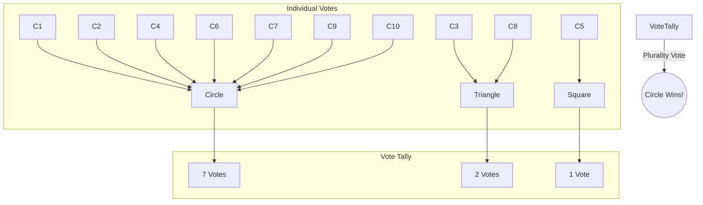
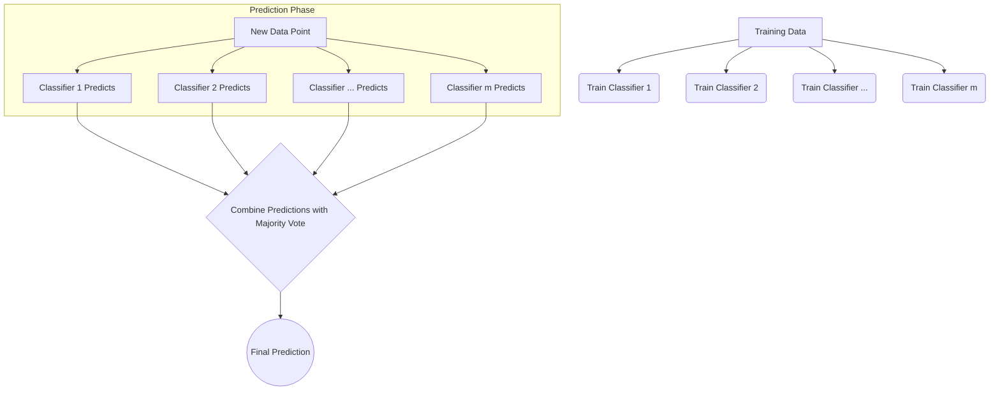
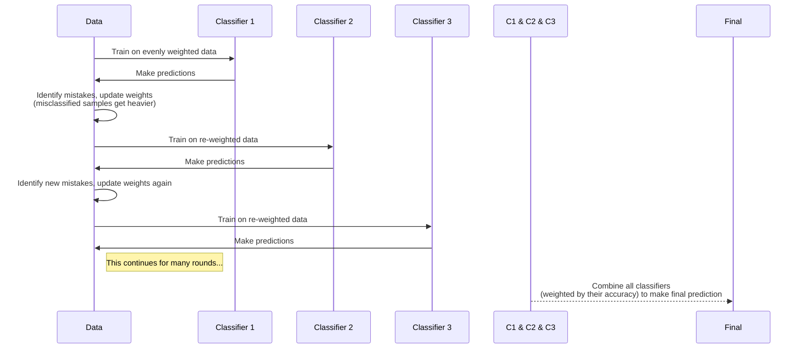

# Chapter 7: Combining Different Models for Ensemble Learning

We will explore how to combine several models into a "team" of classifiers. This team, called an **ensemble**, can often make better and more reliable predictions than any single model on its own.

We will:

  * Make predictions by letting models vote (majority voting).
  * Use a technique called **bagging** to prevent models from "memorizing" the training data too much.
  * Use **boosting** to build a super-strong model from a team of simple, "weak" models.

-----

## Learning with Ensembles 🧠

The main idea of ensemble methods is to combine different classifiers into one "super-classifier" (or meta-classifier) that performs better than any of its individual members.

Think of it like this: Imagine you need to answer a very difficult trivia question. You could ask one expert, who might know the answer. Or, you could ask a room of 10 different experts and combine their answers. The combined answer from the group is often more accurate than any single expert's guess. That's exactly what we're doing with our models.

### The Power of Voting

We'll focus on the most popular type of ensemble method: **majority voting**. It's just like it sounds. If you have several models and most of them vote that an image is a "cat," then the ensemble's final decision is "cat."

  * **Majority Voting:** Used for two choices (like cat or dog). The winner needs more than 50% of the votes.
  * **Plurality Voting:** Used for more than two choices (like cat, dog, or fish). The winner is the one with the most votes, even if it's not over 50%. (This is like how many elections work\!)

Here's a visual of how it works with an ensemble of 10 classifiers trying to classify an item into one of three classes (triangle, square, or circle).



To make a prediction, we train `m` different classifiers ($C\_1, C\_2, ..., C\_m$). Then, we feed them a new piece of data, `x`. Each classifier makes its own prediction. The ensemble's final prediction, `ŷ`, is the one that gets the most votes.

We can write this as a simple formula:

`ŷ = mode{C₁(x), C₂(x), ..., Cₘ(x)}`

Let's break that down:

  * `ŷ` (pronounced "y-hat") is our final prediction.
  * `C₁(x)` is the prediction that the first classifier (`C₁`) makes on our data (`x`).
  * `mode` is a statistical term for the **most frequent value** in a set.

So, the formula just says: "The final prediction is the most common prediction among all the individual classifiers."

This is how a general ensemble system works:



### Why Do Ensembles Work So Well?

Let's use a little math to prove why a team is better than an individual.

Imagine we have a binary (yes/no) classification task. Let's make two simple assumptions:

1.  All our base classifiers have the same error rate, which we'll call ε (epsilon). Let's say ε = 0.25, meaning each classifier is wrong 25% of the time.
2.  The classifiers are **independent**—one classifier's mistake doesn't influence another's.

Under these conditions, the probability of the whole ensemble making a wrong prediction follows a **binomial distribution**. The formula for the ensemble's error is:

`P(y ≥ k) = Σ [from k to n] (n choose k) * εᵏ * (1-ε)ⁿ⁻ᵏ`

This formula looks intimidating, but it's simpler than it appears. Let's break it down for an ensemble of **n=11** classifiers. For the ensemble to be wrong, a majority of classifiers must be wrong. A majority of 11 is 6 or more. So, we're calculating the probability that 6, 7, 8, 9, 10, or all 11 classifiers make a mistake.

  * `P(y ≥ k)`: The probability that the ensemble is wrong. Here, `k=6`.
  * `Σ [from k to n]`: This means "sum up." We're going to add the probabilities for every scenario from `k=6` wrong classifiers up to `n=11` wrong classifiers.
  * `(n choose k)`: This calculates how many different ways you can choose `k` items from a set of `n`. For example, how many unique groups of 6 classifiers can be wrong out of our total of 11?
  * `εᵏ`: If the error rate of one classifier is `ε`, this is the probability of `k` specific classifiers all being wrong (e.g., 0.25⁶).
  * `(1-ε)ⁿ⁻ᵏ`: If `ε` is the chance of being wrong, then `1-ε` is the chance of being right. This is the probability that the other `n-k` classifiers are all correct.

Let's plug in our numbers: `n=11` classifiers, each with an error rate `ε=0.25`. The probability of the ensemble making a mistake is the sum of probabilities of 6, 7, ..., 11 classifiers being wrong.

When you do the math, the result is about **0.034**.

Think about that\! Each individual classifier has a **25%** chance of being wrong, but the team of 11 classifiers only has a **3.4%** chance of being wrong. That's a huge improvement\!

The graph below shows this relationship. As long as the base classifier is better than a random guess (error \< 0.5), the ensemble (solid line) will always be better than the individual base classifier (dashed line).

-----

## Combining Classifiers with Majority Vote

Let's get practical and build our own majority vote classifier.

### Weighted Majority Vote

Sometimes, certain classifiers in our ensemble are more reliable than others. We can give these "smarter" classifiers a bigger say in the final vote by assigning them **weights**.

The formula for a weighted majority vote is a bit complex, but the idea is simple. In plain English, the final prediction is:

`ŷ = "The class 'i' that has the highest sum of weights from all classifiers that voted for it."`

**Example:**
Imagine 3 classifiers vote on a sample.

  * C₁ predicts class 0.
  * C₂ predicts class 0.
  * C₃ predicts class 1.

With equal weights, class 0 wins 2-to-1. But what if we know C₃ is really good? Let's give it a weight of `w₃=0.6`, and the other two weights of `w₁=0.2` and `w₂=0.2`.

  * **Score for class 0:** `w₁ + w₂ = 0.2 + 0.2 = 0.4`
  * **Score for class 1:** `w₃ = 0.6`

Now, class 1 wins\! The weighted vote changed the outcome.

### Using Probabilities Instead of Votes

Some classifiers can do more than just predict a class; they can give us a **probability** for each class (e.g., "I'm 90% sure this is class 0, and 10% sure it's class 1"). Using these probabilities can lead to even better results, especially if the models are well-calibrated.

The formula is very similar. We just pick the class with the highest total weighted probability.

`ŷ = "The class 'i' with the highest sum of (weight * probability) across all classifiers."`

**Example:**
Let's use our 3 classifiers again, but this time they give probabilities for `[Class 0, Class 1]`.

  * C₁: `[0.9, 0.1]`
  * C₂: `[0.8, 0.2]`
  * C₃: `[0.4, 0.6]`

Using our same weights (`w₁=0.2, w₂=0.2, w₃=0.6`):

  * **Final Probability for Class 0:** `(0.2 * 0.9) + (0.2 * 0.8) + (0.6 * 0.4) = 0.18 + 0.16 + 0.24 = 0.58`
  * **Final Probability for Class 1:** `(0.2 * 0.1) + (0.2 * 0.2) + (0.6 * 0.6) = 0.02 + 0.04 + 0.36 = 0.42`

The final combined probability for Class 0 is **0.58**, so the ensemble predicts Class 0.

### Let's Code It\!

The text provides a full Python class `MajorityVoteClassifier`. We won't copy all of it here, but let's see it in action.

First, we prepare the famous **Iris dataset**. We'll use only two flower types (*versicolor* and *virginica*) and two features to make it a bit challenging.

```python
# Load the dataset and prepare it
from sklearn import datasets
from sklearn.model_selection import train_test_split
from sklearn.preprocessing import StandardScaler, LabelEncoder

iris = datasets.load_iris()
# Select features and classes
X, y = iris.data[50:, [1, 2]], iris.target[50:]
le = LabelEncoder()
y = le.fit_transform(y)

# Split data into training and testing sets
X_train, X_test, y_train, y_test = train_test_split(
    X, y, test_size=0.5, random_state=1, stratify=y
)
```

Next, we set up three different classifiers:

1.  A **Logistic Regression** classifier.
2.  A **Decision Tree** classifier (a very simple one, called a "stump").
3.  A **k-Nearest Neighbors (KNN)** classifier.

We check their individual performance using 10-fold cross-validation, measuring their ROC AUC score (a metric where 1.0 is perfect and 0.5 is random guessing).

```python
# Code for setting up classifiers and pipelines...
# clf1 (Logistic Regression), clf2 (Decision Tree), clf3 (KNN)

# Cross-validation results:
10-fold cross validation:
ROC AUC: 0.92 (+/- 0.15) [Logistic regression]
ROC AUC: 0.87 (+/- 0.18) [Decision tree]
ROC AUC: 0.85 (+/- 0.13) [KNN]
```

They're all pretty good, with scores around 0.85-0.92. Now let's combine them into our `MajorityVoteClassifier` ensemble.

```python
# Combine the classifiers into the majority vote ensemble
mv_clf = MajorityVoteClassifier(classifiers=[pipe1, clf2, pipe3])

# Check the ensemble's performance
# ... code for cross_val_score on mv_clf ...

# Results including the ensemble:
ROC AUC: 0.92 (+/- 0.15) [Logistic regression]
ROC AUC: 0.87 (+/- 0.18) [Decision tree]
ROC AUC: 0.85 (+/- 0.13) [KNN]
ROC AUC: 0.98 (+/- 0.05) [Majority voting]
```

Wow\! The ensemble scored **0.98**, which is better than any of the individual models. It's also more stable (the `+/- 0.05` part, called standard deviation, is much smaller).

The plot below shows the **decision boundaries**—the lines the models draw to separate the two classes. You can see how the Majority Voting boundary is a smooth hybrid of the individual models' boundaries.

-----

## Bagging: Building Ensembles from Bootstrap Samples

**Bagging**, which stands for **Bootstrap Aggregating**, is another powerful ensemble technique. It's great for reducing a model's **variance**—its tendency to be overly sensitive to the specific data it was trained on (this is also called **overfitting**).

Here's the idea:
Instead of training every classifier on the exact same dataset, we give each classifier its own random sample of the data. Specifically, we use **bootstrap sampling**, which means we **sample with replacement**.

Imagine your training data is a bag of 10 marbles.

  * To create a bootstrap sample, you pull out one marble, note its color, and **put it back in the bag**.
  * You repeat this 10 times.
  * Your new sample will have 10 marbles, but some original marbles might appear multiple times, and some might not appear at all.

We create many of these bootstrap samples and train one classifier on each. The final prediction is still made by majority vote.

```mermaid
graph TD
    A[Original Training Data (Size N)] -- Bootstrap Sampling --> B1(Sample 1 (Size N));
    A -- Bootstrap Sampling --> B2(Sample 2 (Size N));
    A -- Bootstrap Sampling --> Bm(Sample ... (Size N));

    B1 --> C1(Train Classifier 1);
    B2 --> C2(Train Classifier 2);
    Bm --> Cm(Train Classifier ...);

    C1 & C2 & Cm --> D{Combine Predictions via Majority Vote};
    D --> E((Final Prediction));

    style A fill:#D6EAF8,stroke:#5DADE2
    style D fill:#D5F5E3,stroke:#58D68D
```

### Bagging in Action

Let's apply bagging to the **Wine dataset**. We'll use a single, unpruned Decision Tree as our base classifier. An unpruned tree is very complex and highly likely to overfit.

First, we train the single Decision Tree and check its accuracy.

```python
# Code to load Wine data and train a single decision tree...

# Single Decision Tree Results:
Decision tree train/test accuracies 1.000/0.833
```

The training accuracy is 100% (`1.000`), but the test accuracy is only 83.3% (`0.833`). This is a classic sign of **overfitting**. The model has memorized the training data perfectly but doesn't generalize well to new, unseen data.

Now, let's use `BaggingClassifier` from scikit-learn. We'll create an ensemble of 500 decision trees, each trained on a different bootstrap sample.

```python
from sklearn.ensemble import BaggingClassifier

# tree = our single decision tree from before
# bag = BaggingClassifier using 500 trees

# Bagging Classifier Results:
Bagging train/test accuracies 1.000/0.917
```

Look at that\! The bagging classifier also gets 100% on the training data, but its accuracy on the test data has jumped to **91.7%**\! By combining many overfitted trees, we created a much more robust model. The bagging process smoothed out the "jagged" and overly complex decision boundary of the single tree, making it generalize better.

Bagging is fantastic for reducing variance, but it doesn't help with **bias** (when a model is too simple to capture the data's patterns). That's why we use it with complex, low-bias models like unpruned decision trees.

-----

## Leveraging Weak Learners with Adaptive Boosting (AdaBoost)

**Boosting** is another brilliant ensemble idea. The main concept is to build the ensemble **sequentially**. Each new model added to the team focuses on fixing the mistakes made by the previous models.

The ensemble is made of **weak learners**—very simple models that are only slightly better than random guessing. A common weak learner is a **decision tree stump**, which is a decision tree with only one split.

### How AdaBoost Works

**AdaBoost (Adaptive Boosting)** is the most famous boosting algorithm. It works by adjusting the weights of the *training examples*.

Here's the step-by-step process:

1.  **Start:** Initially, every training example has the same weight. We train our first weak learner on this data.
2.  **Adjust Weights:** Look at the predictions from the first learner.
      * Any examples it got **wrong** now get a **higher weight**.
      * Any examples it got **right** get a **lower weight**.
3.  **Train Next Learner:** Train a second weak learner on the data, but now it will pay more attention to the higher-weighted (i.e., difficult) examples.
4.  **Repeat:** Keep repeating this process—adjusting weights and training a new learner that focuses on the mistakes of the ensemble so far.
5.  **Final Prediction:** The final prediction is a **weighted vote** of all the weak learners. Learners that performed better (had lower error rates on their turn) get a bigger say in the final vote.

<!-- end list -->



The algorithm involves some math to calculate the error rate (ε), the classifier's voting weight (α), and how to update the sample weights (w). But the core idea is simple: **focus on the hard stuff.**

### AdaBoost in Action

Let's try AdaBoost on our Wine dataset. We'll use a decision tree stump as our weak learner.

First, the single decision tree stump's performance:

```python
# Single Decision Tree Stump Results:
Decision tree train/test accuracies 0.916/0.875
```

This simple model is **underfitting**. It's too simple, so it doesn't even do perfectly on the training data.

Now, let's boost it with AdaBoost, using 500 stumps in our ensemble.

```python
# ada = AdaBoostClassifier with 500 stumps

# AdaBoost Results:
AdaBoost train/test accuracies 1.000/0.917
```

Incredible\! By combining 500 very simple models, we created a powerful ensemble that gets 100% on the training data and **91.7%** on the test data. We took a model that was too simple (high bias) and turned it into a complex, accurate classifier.

The decision boundary of AdaBoost is much more complex and effective than the single stump's boundary.

Boosting is powerful, but it can be prone to overfitting if you use too many rounds or if the weak learners are too complex. It's a trade-off between reducing bias and not increasing variance too much.

-----

## Gradient Boosting: Training on Mistakes

**Gradient Boosting** is a more modern and often more powerful type of boosting. Like AdaBoost, it builds an ensemble of trees sequentially, where each tree learns from the previous one's mistakes.

The key difference is *how* it learns from mistakes.

  * **AdaBoost** adjusts the **weights of the training samples**.
  * **Gradient Boosting** directly fits the next tree to the **errors (residuals)** of the previous tree's predictions.

Imagine you're trying to predict house prices.

1.  Your first tree makes a prediction. Maybe it predicts a house is worth $300k, but its actual price is $350k. The error (residual) is +$50k.
2.  Your second tree's job is not to predict the house price, but to predict that **error**. It tries to predict "+$50k".
3.  You add this new prediction to the first one, getting you closer to the true value.

You keep doing this, with each new tree correcting the leftover error from the ensemble so far. The term "gradient" comes from the fact that this process uses a mathematical technique called gradient descent to minimize the ensemble's overall error.

### Using XGBoost

While scikit-learn has a `GradientBoostingClassifier`, a faster and more famous implementation is **XGBoost** (eXtreme Gradient Boosting). It's known for winning countless data science competitions on sites like Kaggle.

Using it is simple because it follows the scikit-learn API.

```python
import xgboost as xgb

# model = xgb.XGBClassifier(...)
# gbm = model.fit(X_train, y_train)

# XGBoost Results:
XGboost train/test accuracies 0.968/0.917
```

Once again, we get an excellent test accuracy of **91.7%**, showing the power of these advanced boosting methods.

-----

## Summary

On this notebook, I explored the exciting world of **ensemble learning**, where teams of models outperform individuals.

  * We saw how **majority voting** combines predictions from different models to improve accuracy and stability.
  * I learned about **bagging**, a technique that reduces overfitting by training models on random bootstrap samples of the data. Random Forests are a famous example of bagging.
  * I dove into **boosting** (AdaBoost and Gradient Boosting), where simple "weak" models are trained sequentially, each one focusing on the mistakes of its predecessors to create an incredibly strong final model.

Ensemble methods often provide the best performance, but they come at a cost of higher computational power and complexity. For many real-world problems and competitions, that trade-off is well worth it\!